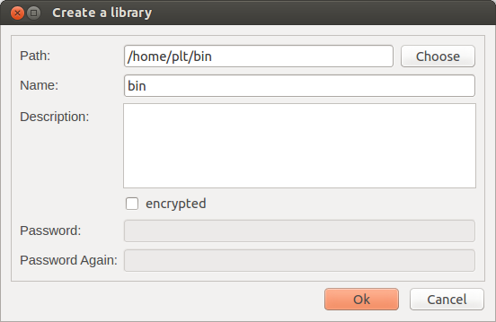

# Installing Seafile Desktop Client

After downloading Seafile client program, you have 3 steps left to get it up and running.

## 1. Select a disk partition to store local Seafile data

## 2. Add an account

Add an account on your private Seafile server or our public server.

## 3. Sync a library

* Click the "Sync this library" button to sync it with a local folder.
* Then you add some files into the library. They will be automatically synced with cloud platform.

## 4. (Optional) Create a library

You can also create a library from a local folder.

## 5. Browse files on the cloud
In some occasions, you want to modify files on the cloud directly without syncing them. Seafile client comes with a "cloud file browser" to meet this need. Click an unsynced library will open the cloud file browser.

