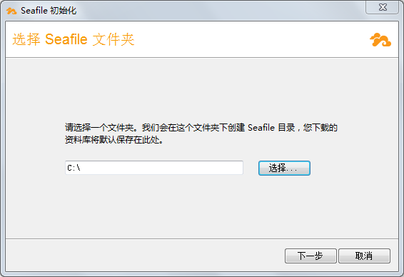
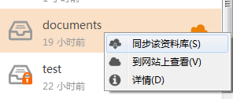
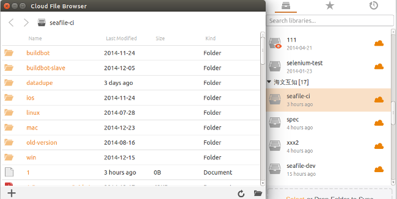

# 安装Seafile桌面客户端

下载完Seafile客户端程序后，你需要设置如下三步来让它运行。

## 1. 选择一个磁盘分区来存储Seafile数据

## 2. 添加一个账户

添加一个账户到你的私有Seafile服务器或者公共服务器。

## 3. 选择一个需要同步的资料库

* 点击"同步该资料库"按钮来和本地文件夹同步
* 然后添加一些文件到该资料库中，从而自动地和服务器上的资料库同步。

## 4. (可选) 创建一个资料库

你也可以依靠本地文件夹来创建一个资料库

## 5. 在云端浏览资料库
在某些情况下，你可能想直接在云端修改某些文件而不同步他们。Seafile客户端提供了一个"云端文件浏览器"来满足这样的需求。点击一个未被同步的资料库就会打开该文件浏览器。

